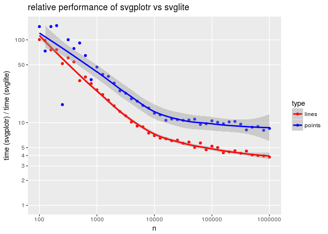

<!-- README.md is generated from README.Rmd. Please edit that file -->
[](https://travis-ci.org/mpadge/svgplotr) [](https://codecov.io/gh/mpadge/svgplotr) [](http://www.repostatus.org/#concept)

svgplotr
========

Fast `svg` plots in **R**. Currently just a demonstration of speed relative to [`svglite`](https://github.com/r-lib/svglite) based on two functions:

1.  `getdat(n)` which generates a series of `n` random edges tracing a single path with varying colours and line widths; and
2.  `svgplot()` to write those data to a `html`-formatted `svg` file.

Comparison is against a `ggplot2` object with no embellishments, set up with the following code

``` r
require (ggplot2)
ggmin_theme <- function ()
{
    theme <- theme_minimal ()
    theme$panel.background <- element_rect (fill = "transparent",
                                                     size = 0)
    theme$line <- element_blank ()
    theme$axis.text <- element_blank ()
    theme$axis.title <- element_blank ()
    theme$plot.margin <- margin (rep (unit (0, 'null'), 4))
    theme$legend.position <- 'none'
    theme$axis.ticks.length <- unit (0, 'null')
    return (theme)
}
ggfig <- function (dat)
{
    ggplot () + ggmin_theme () +
        geom_segment (aes (x = xfr, y = yfr, xend = xto, yend = yto,
                       colour = col, size = lwd), size = dat$lwd, data = dat)
}
```

One set of random lines can then be generated and plotted like this:

``` r
dat <- getdat (n = 1e4, xylim = 1000)
ggfig (dat)
```


Timing Comparison
-----------------

`svgplotr` is considerably faster than `svglite`, but speed differences depend on numbers of lines (`n` in `getdat()`). The following code returns quantifies the time taken by `svglite` in comparison to `svgplotr` as a function of `n`.

``` r
require (svglite)
plotgg <- function (fig)
{
    svglite ("lines.svg")
    print (fig)
    graphics.off ()
}

do1test <- function (n = 1e3, nreps = 5)
{
    dat <- getdat (n = n)
    fig <- ggfig (dat)
    rbenchmark::benchmark (
                           plotgg (fig),
                           svgplot (dat, filename = "lines"),
                           order = "test",
                           replications = nreps)$relative [1]
}

n <- 10 ^ (20:60 / 10)
y <- sapply (n, do1test)
```

Then plot the results

``` r
dat <- data.frame (n = n, y = y)
ggplot (dat, aes (x = n, y = y)) +
    theme (panel.grid.minor = element_blank ()) +
    scale_x_log10 (breaks = 10 ^ (2:6)) +
    scale_y_log10 (limits = c (1, max (y)),
                   breaks = c (1:5, 10, 50, 100)) +
    geom_point () +
    geom_smooth (method = "loess", se = TRUE) +
    ylab ("time (svgplotr) / time (svglite)") +
    labs (title = "relative performance of svgplotr vs svglite")
#> Warning: Removed 2 rows containing missing values (geom_smooth).
```



And efficiency gains initially decrease exponentially, but then flatten out and appear to approach an asymptotic limit of around three times faster. Even for the maximum size in this plot of 1 million edges, `svgplotr` is almost 4 times faster than `svglite`. The right portion of the graph may also be a second exponential regime, but even if so, parity is only going to be reached at:

``` r
indx <- which (n >= 1e5)
mod <- as.numeric (lm (log10 (y [indx]) ~ log10 (n [indx]))$coefficients)
format (10 ^ (mod [1] / abs (mod [2])), scientific = TRUE, digits = 2)
#> [1] "1.3e+11"
```

which is 130 billion edges. Parity is not really going to happen, and `svgplotr` will always remain faster than `svglite`.
